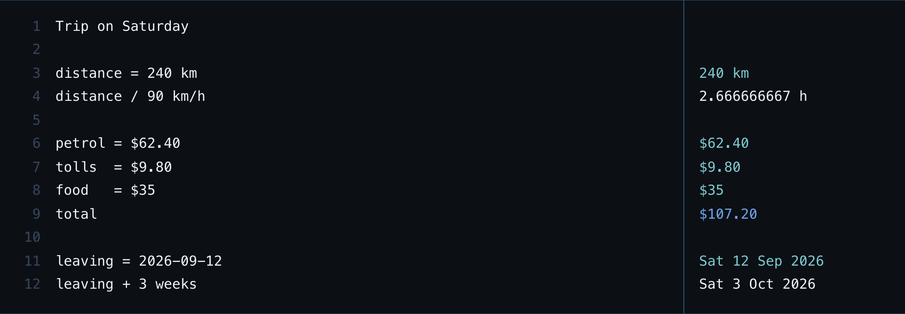

# notepad

Type maths in prose. Each line is worked out on its own and its answer sits in the margin.



```
Trip on Saturday

distance = 240 km
distance / 90 km/h        2.666666667 h

petrol = $62.40           $62.40
tolls  = $9.80            $9.80
food   = $35              $35
total                     $107.20

leaving = 2026-09-12      Sat 12 Sep 2026
leaving + 3 weeks         Sat 3 Oct 2026
```

Blank lines and sentences produce nothing. Names carry forward. Nothing leaves the page.

## What it knows

Units of length, mass, time, data and angle, and anything you can build out of them by
multiplying and dividing: `100 km/h`, `2 m^2`, `240 km / 90 km/h`. Percentages, where
`120 + 10%` is 132 rather than 130. Money, as a total rather than as a conversion. Dates,
which move by whole days and by clamped months.

## Four decisions worth knowing about before you use it

**A wrong number is the worst thing this could produce**, so it never produces one. Every
failure is a value rather than an exception: a line that cannot be worked out shows a short
reason in its own margin and leaves every other line alone. A name bound to a failure
poisons only the lines that mention it, and those read `depends on line 4, which failed`
rather than repeating a reason that is not about them. Nothing anywhere falls back to zero.

**`3 m + 2 kg` is an error, and so is `3 m + 2`.** A quantity carries a dimension as five
integer exponents, and compatibility is tuple equality, so mismatches are impossible rather
than unlikely. There is no coercion for `+`, not even the tempting one where a plain number
is treated as a scalar: whoever typed `3 m + 2` either meant `3 m + 2 m` or meant something
this cannot know, and guessing produces a number that is confidently wrong.

**Dates have no time of day and no timezone.** `leaving + 3 weeks` is integer arithmetic on
a day count, so it cannot land an hour out twice a year and it does not depend on where you
are sitting. Months and years are not durations and are not in the unit table, because a
month is not a fixed number of seconds and pretending otherwise would make every answer
that used one quietly wrong. `31 Jan + 1 month` is `28 Feb`, clamped, which is what every
calendar does.

**There are no exchange rates and there never will be.** `$1,850 + $150` is `$2,000`,
because totalling expenses involves no rate at all. `$5 + €5` is an error that says why.
Any rate this shipped would be our own stale number wearing a timestamp, and that is worse
than saying it does not know. Timezones go the other way for the same reason: the browser
ships a database its vendor patches, and it ships no rates.

## Two things it gets wrong, written down rather than hidden

`Call Bob at 5` is treated as arithmetic, because the rule for telling prose from a mistake
is "no number, no `=` and no known name". `Milk and eggs` is silent and `3 kg +` is not, and
that is the trade: this fails cosmetically rather than numerically.

`1/2 m` is one per two metres, not half a metre. A number and the units after it are one
operand, which is what makes `240 km / 90 km/h` come out as hours; the same rule makes this
one a rate. They are the same shape and want opposite groupings, and no precedence gives
both. The answer is visibly a rate, so it announces that it was read differently.

## Running it

```bash
npm install
npm run dev
npm test          # 240 unit tests
npm run e2e       # 6, and they check the one thing only a browser can
npm run build
```

React and nothing else at runtime, enforced by `scripts/check-deps.mjs` in CI. The units
table, the parser and the timezone resolver are hand written, and each of those decisions
has its argument in the file that implements it.

MIT © James Kim
